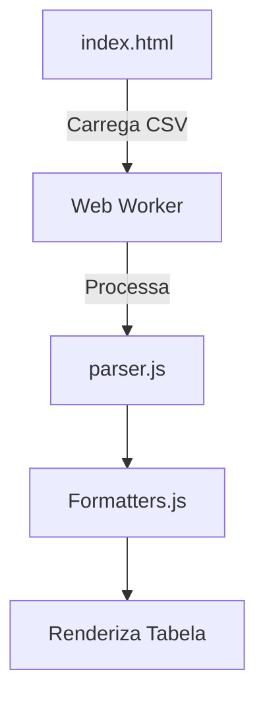

# Análise do Projeto Analisador de FIIs

## Visão Geral
Este documento resume o trabalho realizado no projeto até o momento, incluindo:
- Arquitetura implementada
- Problemas encontrados e soluções aplicadas
- Fluxo de processamento de dados
- Próximos passos recomendados

## Arquitetura do Sistema


## Principais Arquivos

### 1. `index.html` (Interface Principal)
- Gerencia todo o fluxo de UI
- Implementa Web Worker para processamento paralelo
- Contém lógica de:
  - Carregamento e exibição de dados
  - Filtragem e ordenação
  - Gerenciamento de estados (loading/error)

### 2. `public/csv.worker.js` (Web Worker)
- Responsável por processar CSV em segundo plano
- Usa `importScripts` para carregar `parser.js`
- Comunica com main thread via `postMessage`

### 3. `src/js/data/parser.js` (Parser de CSV)
- Contém lógica central de parsing de CSV
- Transforma texto CSV em objetos JavaScript
- Valida e estrutura dados de FIIs

### 4. `src/js/utils/formatters.js` (Formatadores)
- Funções utilitárias para formatação de:
  - Moeda (R$)
  - Porcentagens
  - Números
  - Decimais

## Erros Encontrados e Soluções

### 1. Indicador de Carregamento Infinito
**Problema**:  
O loading indicator não desaparecia após carregamento completo

**Solução**:  
- Substituição de `display: none` por classe `hidden` do Tailwind
- Adição de logs detalhados no fluxo de carregamento
- Verificação de existência do elemento DOM antes de manipulação

**Código Corrigido**:
```javascript
function hideLoading() {
    console.log("Executando hideLoading()");
    const loadingElement = document.getElementById('loadingIndicator');
    if (loadingElement) {
        loadingElement.classList.add('hidden');
        console.log("Loading indicator escondido via classe hidden");
    }
}
```

### 2. Problema de Importação de Módulos no Web Worker
**Problema**:  
O worker não conseguia carregar `parser.js` via ES6 modules

**Solução**:
- Uso de `importScripts` para carregamento síncrono
- Comunicação via `postMessage` com estrutura de erro

**Código Implementado**:
```javascript
// csv.worker.js
importScripts('./src/js/data/parser.js');

self.onmessage = function(e) {
    try {
        const result = self.parseCSV(e.data.csvText);
        postMessage({ success: true, data: result });
    } catch (error) {
        postMessage({ success: false, error: error.message });
    }
}
```

### 3. Bloqueio de UI durante Parsing de CSV
**Problema**:  
Interface congelava durante processamento de grandes CSVs

**Solução**:
- Migração do parsing para Web Worker
- Divisão de responsabilidades:
  - Main thread: UI e interação
  - Worker: Processamento pesado

## Fluxo de Carregamento Atual

1. `index.html` inicia carregamento
2. Mostra loading indicator
3. Inicia Web Worker (`csv.worker.js`)
4. Worker carrega `parser.js` via `importScripts`
5. Worker processa CSV e retorna dados estruturados
6. Main thread:
   - Atualiza filtros
   - Renderiza tabela
   - Esconde loading indicator
   - Mostra conteúdo principal

## Próximos Passos Recomendados

1. **Otimização de Performance**:
   - Implementar processamento por chunks para grandes CSVs
   - Adicionar indicador de progresso real

2. **Melhorias de UX**:
   - Adicionar paginação na tabela
   - Implementar busca textual
   - Melhorar tratamento de erros

3. **Refatorações**:
   - Separar lógica de negócios de UI
   - Criar módulo independente para gestão de estado
   - Adicionar testes unitários

4. **Novas Funcionalidades**:
   - Gráficos comparativos
   - Favoritos e watchlists
   - Alertas personalizados

## Conclusão
O sistema foi significativamente melhorado com:
- Processamento paralelo via Web Workers
- Melhor tratamento de erros
- Interface mais responsiva
- Monitoramento detalhado via logs

Os principais desafios técnicos foram resolvidos e a base está sólida para novas funcionalidades.