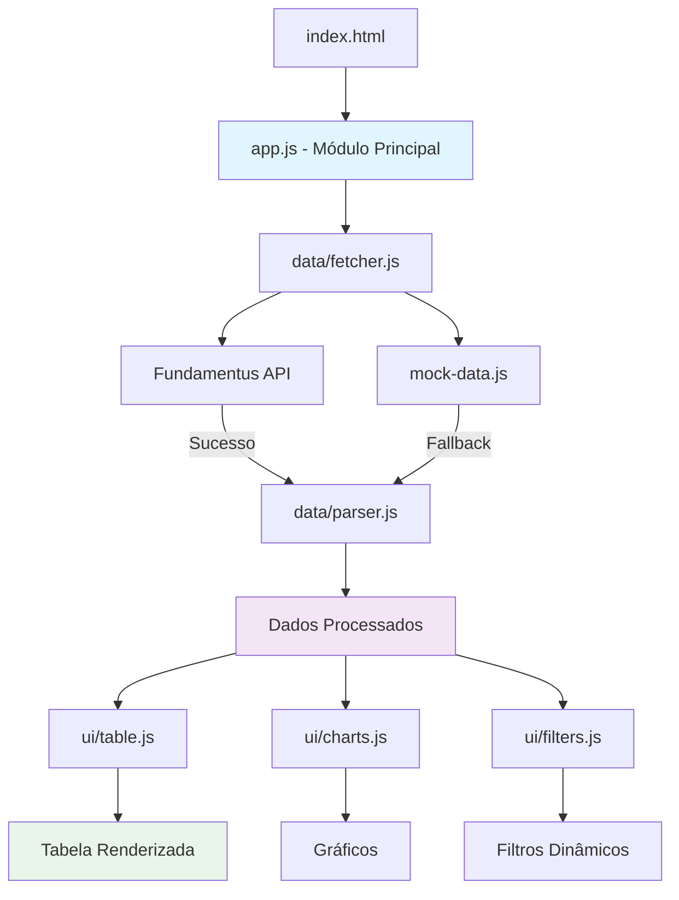

# Plano Detalhado - Analisador Quantitativo de FIIs

## 1. Estrutura do Projeto

```
Analisador de FII-2025/
├── index.html                 # Página principal
├── src/
│   ├── js/
│   │   ├── app.js            # Módulo principal (IIFE)
│   │   ├── data/
│   │   │   ├── fetcher.js    # Coleta de dados (web scraping + fallback)
│   │   │   ├── parser.js     # Parsing do HTML do Fundamentus
│   │   │   └── mock-data.js  # Dados mock para fallback
│   │   ├── ui/
│   │   │   ├── table.js      # Renderização da tabela
│   │   │   ├── filters.js    # Lógica de filtros
│   │   │   ├── charts.js     # Gráficos simples
│   │   │   └── modal.js      # Modal informativo
│   │   └── utils/
│   │       ├── formatters.js # Formatação de números brasileiros
│   │       └── sorters.js    # Lógica de ordenação
│   └── css/
│       ├── main.css          # Estilos customizados
│       └── components/
│           ├── table.css     # Estilos da tabela
│           ├── modal.css     # Estilos do modal
│           └── charts.css    # Estilos dos gráficos
├── assets/
│   ├── images/
│   │   └── loading.svg       # Ícone de carregamento
│   └── fonts/                # Fontes locais (se necessário)
├── docs/
│   └── README.md            # Documentação do projeto
└── package.json             # Metadados do projeto (opcional)
```

## 2. Arquitetura e Fluxo de Dados



## 3. Componentes Principais

### 3.1 Módulo Principal (app.js)
- **Responsabilidade**: Orquestração geral da aplicação
- **Funcionalidades**:
  - Inicialização da aplicação
  - Gerenciamento do estado global
  - Coordenação entre módulos
  - Tratamento de erros globais

### 3.2 Sistema de Dados
- **fetcher.js**: Requisições HTTP com proxy CORS e fallback
- **parser.js**: Parsing do HTML do Fundamentus
- **mock-data.js**: Dados de exemplo para demonstração

### 3.3 Interface do Usuário
- **table.js**: Renderização e manipulação da tabela
- **filters.js**: Filtros por setor e busca
- **charts.js**: Gráficos usando Chart.js ou biblioteca similar
- **modal.js**: Modal informativo sobre dados

### 3.4 Utilitários
- **formatters.js**: Formatação de números, percentuais, moeda
- **sorters.js**: Algoritmos de ordenação para diferentes tipos de dados

## 4. Especificações Técnicas

### 4.1 Indicadores dos FIIs
| Campo | Tipo | Formato | Descrição |
|-------|------|---------|-----------|
| Papel | String | XXXX11 | Ticker do FII |
| Setor | String | Texto | Setor de atuação |
| Cotação | Number | R$ XX,XX | Preço atual |
| P/VP | Number | X,XX | Preço sobre Valor Patrimonial |
| Dividend Yield | Number | XX,X% | Rendimento anual |
| Liquidez | Number | XXX.XXX | Volume médio diário |
| Patrimônio Líquido | Number | R$ XXX.XXX.XXX | PL do fundo |
| Vacância | Number | XX,X% | Taxa de vacância |

### 4.2 Funcionalidades de Filtragem
- **Por Setor**: Dropdown com todos os setores disponíveis
- **Ordenação**: Clique nos cabeçalhos para ordenar (ASC/DESC)
- **Busca**: Campo de texto para buscar por ticker

### 4.3 Gráficos Simples
- **Distribuição por Setor**: Gráfico de pizza
- **Ranking Dividend Yield**: Gráfico de barras (top 10)
- **P/VP vs Dividend Yield**: Gráfico de dispersão

## 5. Tecnologias e Bibliotecas

### 5.1 Core
- **HTML5**: Estrutura semântica
- **CSS3**: Estilização moderna
- **JavaScript ES6+**: Lógica da aplicação
- **Tailwind CSS**: Framework CSS utility-first

### 5.2 Bibliotecas Adicionais
- **Chart.js**: Para gráficos simples e responsivos
- **CORS Proxy**: cors-anywhere ou similar (desenvolvimento)

### 5.3 Ferramentas de Desenvolvimento
- **ESLint**: Linting do JavaScript
- **Prettier**: Formatação de código

## 6. Implementação por Fases

### Fase 1: Estrutura Base
1. Criar estrutura de arquivos
2. Configurar HTML principal com Tailwind
3. Implementar módulo principal (IIFE)
4. Criar sistema de dados mock

### Fase 2: Funcionalidades Core
1. Implementar parser do HTML
2. Criar renderização da tabela
3. Adicionar sistema de filtros
4. Implementar ordenação

### Fase 3: Web Scraping
1. Configurar fetcher com proxy CORS
2. Implementar fallback para dados mock
3. Adicionar tratamento de erros
4. Criar indicadores de loading

### Fase 4: Gráficos e UI Avançada
1. Integrar Chart.js
2. Criar gráficos de distribuição
3. Implementar modal informativo
4. Otimizar responsividade

### Fase 5: Polimento
1. Adicionar animações CSS
2. Otimizar performance
3. Testes manuais
4. Documentação final

## 7. Considerações de Produção

### 7.1 CORS e Proxy
- **Desenvolvimento**: Usar proxy público (cors-anywhere)
- **Produção**: Implementar backend próprio como proxy
- **Fallback**: Sempre disponível com dados mock

### 7.2 Performance
- **Lazy Loading**: Carregar gráficos apenas quando necessário
- **Debounce**: Para filtros de busca em tempo real
- **Caching**: Cache local dos dados por sessão

### 7.3 Acessibilidade
- **ARIA Labels**: Para elementos interativos
- **Navegação por teclado**: Suporte completo
- **Contraste**: Cores acessíveis

## 8. Estrutura de Dados

```javascript
// Exemplo de objeto FII
const fiiExample = {
  ticker: "MXRF11",
  setor: "Papel e Celulose",
  cotacao: 10.30,
  pvp: 1.02,
  dividendYield: 12.1,
  liquidez: 2500000,
  patrimonioLiquido: 1200000000,
  vacancia: 5.2
};
```

## 9. Princípios de Clean Code Aplicados

### 9.1 Modularidade
- Uso de IIFE para encapsulamento
- Separação clara de responsabilidades
- Módulos independentes e reutilizáveis

### 9.2 Nomenclatura
- Nomes descritivos para variáveis e funções
- Convenções consistentes de nomenclatura
- Evitar abreviações desnecessárias

### 9.3 Funções
- Funções pequenas e coesas
- Uma responsabilidade por função
- Parâmetros claros e bem definidos

### 9.4 Comentários
- Comentários explicativos para lógica complexa
- Documentação de decisões de design
- Explicação de workarounds (ex: CORS)

## 10. Próximos Passos

1. **Aprovação do Plano**: Confirmar todos os detalhes
2. **Criação da Estrutura**: Implementar arquivos base
3. **Desenvolvimento Iterativo**: Seguir as fases definidas
4. **Testes e Validação**: Verificar funcionalidades
5. **Documentação**: Finalizar README e comentários

---

**Nota**: Este plano serve como guia para implementação. Ajustes podem ser necessários durante o desenvolvimento baseados em descobertas técnicas ou mudanças de requisitos.